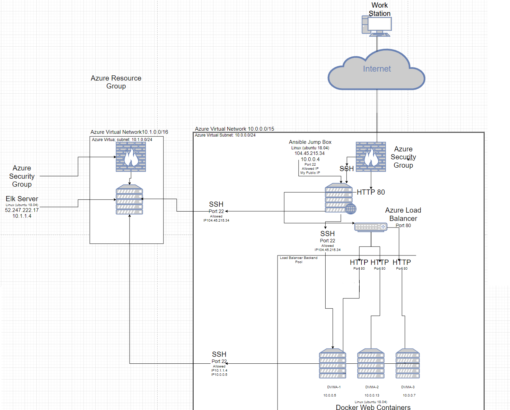

This network sets up a highly redundant, and highly resilient server that allows selected users to be able to access a private and secure webserver through IP network addresses. It is accessed from the internet, but not accessible by the public. The following document Details
-	Description of the Topology
-	Access Policies
-	Ansible setup
-	ELK configuration
