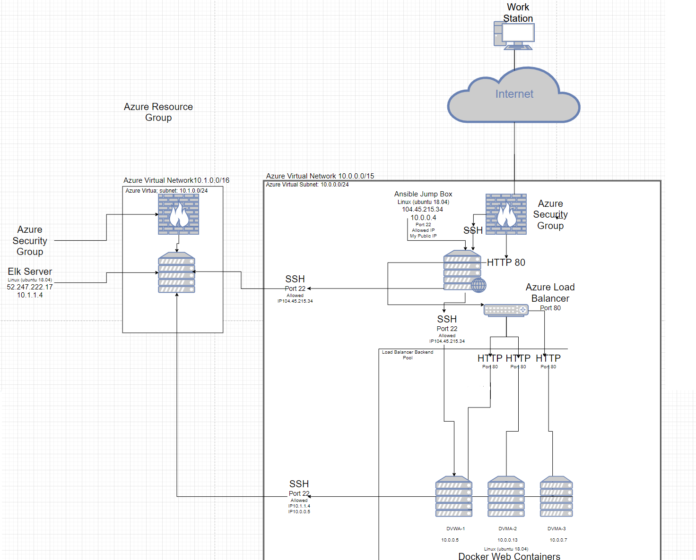
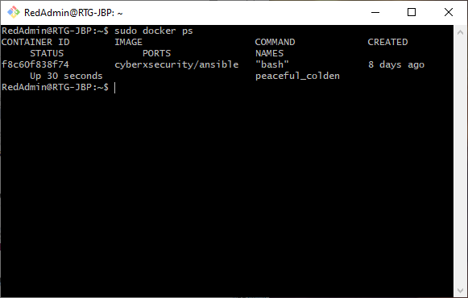
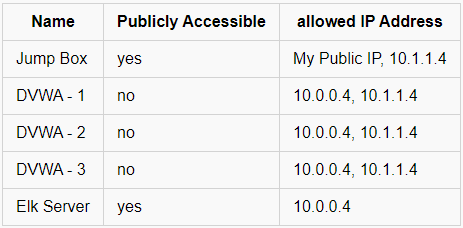
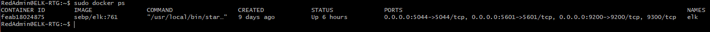
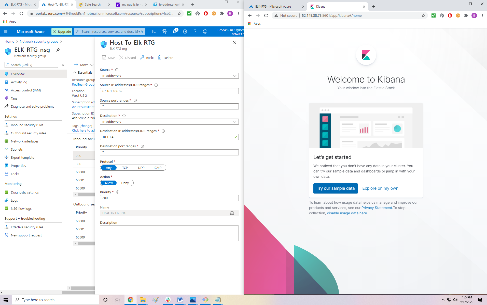

The files in this repository were used to configure the network depicted below.

This network sets up a highly redundant, and highly resilient server that allows selected users to be able to access a private and secure webserver through IP network addresses. It is accessed from the internet, but not accessible by the public. The following document Details
-	Description of the Topology
-	Access Policies
-	Ansible setup
-	ELK configuration

Topology 

The Red Team Group will be assigned IP network ID’s to be able to access a penetration testing web server, Damn Vulnerable Web Application. Once the Red Team Group has their IP’s, they will be able to log into the server with ssh key and by user names set up by RedAdmin, the system administrator for the Red Team Group. If accessed from a different work station, The RTG’s Firewall will not allow non listed ip’s into the server, the user will not be granted access due to the RTG’s firewall configuration.  
VM’s on the internal network are not exposed to the public and must be logged in by ssh to private key, since the web Server VM’s do not have a public facing IP, The private IP’s must be used from the jump box to be able to modify or make changes to a specific webserver. The Elk server will be monitoring all the instances of the webservers, and must be able to access the Webservers by private IP’s of the internal network; these changes can be made In the Install_Elk.cfg file in the Ansible directory inside the Docker Container. The elk server is only accessible in the Container inside the jumpBox.

_Note: Use the [Markdown Table Generator](http://www.tablesgenerator.com/markdown_tables) to add/remove values from the table_.

If the servers should go down, the network is supported by a load balancer that will keep the web application operating should the server be overloaded and no longer be accessible. All web traffic flows through this load balancer through port 80, and traffic is guided by a public front end IP.  The webservers do not have a public IP and are only accessed through Private IP addresses only. This Load balancer has two other redundant servers, should one fail, two more can take its place while the down server is being fixed. To make setup of these 3 webservers speedy and efficient, the System Administrator has access to an Ansible JumpBox Provionser. 

Ansible Setup

Ansible jumpBox is used to make updates from script files to configure multiple servers; this sends quick and easy updates across multiple webservers, to make them all the same at the same time. if a change is need on the servers, Ansible can send updates to all the servers when changes are needed. These changes might be patches, updates, and installing applications.

-	Sudo apt-get Install docker.io
-	Sudo docker –ti start container
-	Sudo docker container list –a
-	Sudo docker start peaceful_colden
-	Sudo docker attach peaceful_colden

The playbook is a yml file, and it is copied in the ansible Container under /etc/Ansible/. The Ansible hosts file is responsible for sending the playbook book across the VMs’ listed inside the configuration file, the machines are listed by Private IP inside this file. If more machines need to be added, or if a specific set needs to be changed, this is where VMs’ are listed for updates. The elk Server needs the IP’s of the internal network VMs in order to be able to use the filebeat and metric beat playbooks. These will be listed in the Ansible Hosts file.

Elk Configuration

In order to make sure nothing major is changed in the network, or to watch for suspicious behavior, we have an ELK (Elastic, Logstash, Kibana) server that will monitor web traffic across the three servers, this is to make sure that who belong on the network are the ones with authorized access. If an unauthorized user gains access to the RTG’s network, The elk server will be able to monitor and report malicious changes to the server and system logs. Filebeat collects data about the file system, such as changes to accounts, sudo attempts, denied, success, and user log data. MetricBeat collects machine metrics, such as cpu usage, memory, inbound/outbound traffic transfer. These will help visualize areas of concern when a breach is suspected.
Ansible is used to setup and configure the Elk Machine, the elk server setup is managed using scripts, Ansible allows for quick deployment should the server go down down or need to be replaced, the scripts will have it setup in minutes, rather than having to type everything out manually. Once the scripts have successfully ran, the elk server should be running, the following screenshot displays the results of running docker ps, showing the elk instance has been installed and running. 

Installing Playbooks

	Once the Docker Container is running and Ansible has been configured in the container, you’ll then be able to nano YAML files with playbook information. 

-	SSH into your jump box with your docker machines, then from there run 
-	Sudo docker container list -a
-	Sudo docker start [container name]
-	Sudo docker attach [container name]
-	 Navigate to Cd /etc/ansible/files and copy the Install_Elk.yml into this directory
-	Update host files to include the VM’s Elk will be moinitoring
-	Run the playbook using ansible-playbook Install_elk.yml
-	Use the Elk Machines Public IP followed by the specified port 5601 
-	http://52.250.22.180:5601/app/kibana
If setup Correctly, the following page should pop up on the Admins web Browser, where elk data can be monitored and viewed. 

PlayBook Commands 

filebeat-config.yml 
curl https://github.com/Brookras/UCD_ELK_Stack/blob/master/Ansible/Filebeat-Config.yml  > /etc/ansible/Files1/filebeat-config.yml

metricbeat-config.yml curl  https://github.com/Brookras/UCD_ELK_Stack/blob/master/Ansible/Metricbeat-config.yml > /etc/ansible/Files1/metricbeat-config.yml

filebeat-playbook.yml 
 curl https://github.com/Brookras/UCD_ELK_Stack/blob/master/Ansible/Filebeat-Playbook.yml  > /etc/ansible/roles/filebeat-playbook.yml

metricbeat-playbook.yml
curl https://github.com/Brookras/UCD_ELK_Stack/blob/master/Ansible/Metricbeat-Playbook.yml  > /etc/ansible/Files1/metricbeat-playbook.yml

install-elk.yml curl https://github.com/Brookras/UCD_ELK_Stack/blob/master/Ansible/Install_Elk.yml  > /etc/ansible/Files1/install-elk.yml
